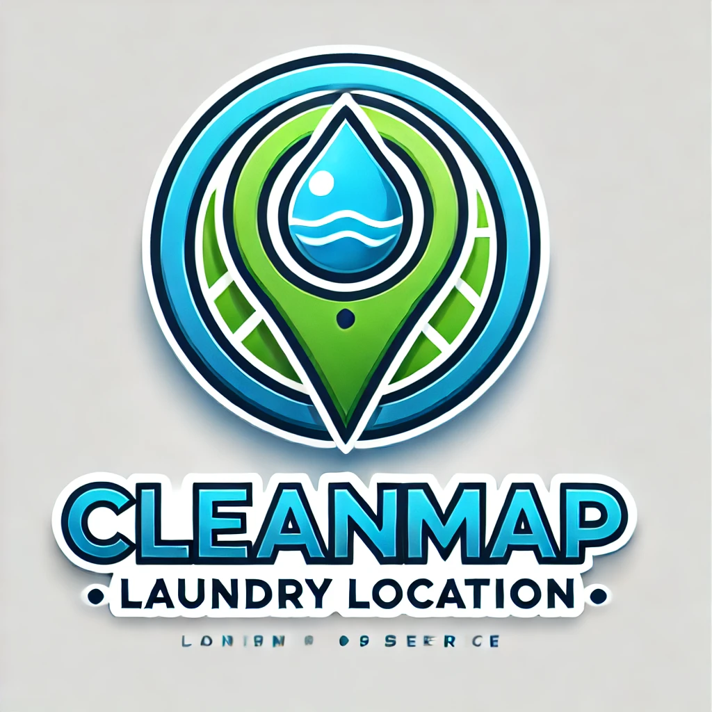

CleanMap 🧺📍

<b>Platform Pemetaan dan Manajemen Layanan Laundry Terpadu</b>

📖 Tentang CleanMap

CleanMap adalah solusi digital berbasis web yang dirancang untuk menjembatani pelanggan dengan penyedia jasa laundry. Menggunakan kekuatan Laravel, proyek ini menyediakan visualisasi peta untuk menemukan titik laundry terdekat serta memberikan akses penuh bagi Admin untuk mengelola ekosistem laundry secara efisien.

🚀 Fitur Saat Ini

📍 Pemetaan Interaktif: Integrasi koordinat geografis untuk menampilkan titik-titik lokasi laundry di peta secara real-time.

🖼️ Manajemen Galeri: Sistem manajemen aset foto yang memungkinkan pengunggahan dokumentasi fasilitas dan hasil kerja laundry.

🛡️ Otorisasi Admin: Sistem keamanan berbasis Middleware CheckRole yang saat ini dioptimalkan untuk akses kontrol penuh oleh Administrator.

📊 Dashboard Statistik: Visualisasi data laundry dan pengguna untuk mempermudah monitoring pertumbuhan bisnis.

🚧 Roadmap Pengembangan (Butuh Kontributor!)

Kami sedang aktif mengembangkan fitur-fitur berikut dan sangat terbuka bagi siapapun yang ingin berkontribusi:

[ ] Sistem Ulasan & Rating: Implementasi logika agar pelanggan bisa memberikan feedback pada setiap laundry.

[ ] Multi-Role System: Ekspansi peran pengguna untuk mendukung akun 'Pemilik Laundry' dan 'Member' dengan dashboard terpisah.

[ ] Integrasi Notifikasi: Pengingat status cucian melalui email atau platform pesan singkat.

🛠️ Persyaratan Sistem

PHP >= 8.2

Composer

Node.js & NPM

Database: MySQL, PostgreSQL, atau SQLite.

📦 Panduan Instalasi Cepat

Clone & Masuk ke Direktori

git clone [https://github.com/iqbalpraw/cleanmap.git](https://github.com/iqbalpraw/cleanmap.git)
cd cleanmap

Instalasi Dependensi

composer install
npm install

Pengaturan Environment

cp .env.example .env
php artisan key:generate

Jangan lupa atur koneksi database di file .env.

Migrasi & Sinkronisasi

php artisan migrate --seed
npm run dev

Jalankan Aplikasi

php artisan serve

🤝 Mari Berkontribusi!

CleanMap adalah proyek Open Source. Jika Anda ingin memperbaiki bug, menambah fitur, atau sekadar memperbaiki dokumentasi, silakan:

Lakukan Fork pada repositori ini.

Buat branch fitur Anda (git checkout -b feature/nama-fitur).

Lakukan Commit perubahan (git commit -m 'Menambahkan fitur XYZ').

Push ke branch Anda (git push origin feature/nama-fitur).

Buka Pull Request.

📄 Lisensi

Didistribusikan di bawah Lisensi MIT. Lihat file LICENSE untuk informasi lebih lanjut.

Dikelola oleh <a href="https://www.google.com/search?q=https://github.com/iqbalpraw">Iqbal Prawira</a>

